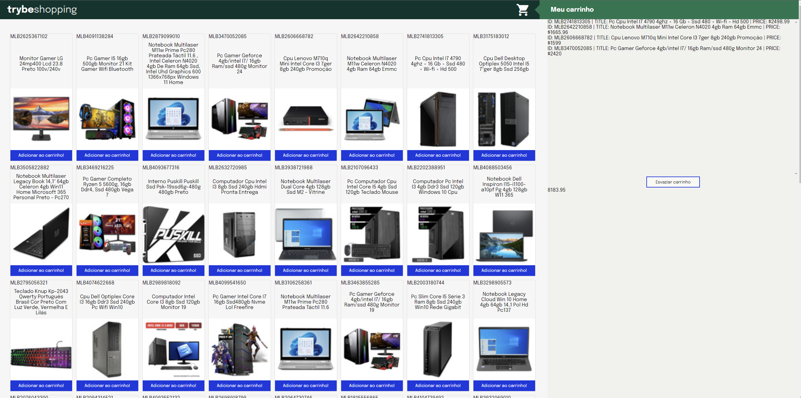

# Projeto Shopping Card (Sétimo projeto desenvolvido)

Como desafio neste projeto, abracei a tarefa de conceber a lógica intricada que alimenta um carrinho de compras dinâmico, capacitando os usuários a adicionar e remover produtos com facilidade. Tudo isso foi alcançado com a pura essência do JavaScript, sem a necessidade de bibliotecas ou frameworks adicionais. O coração pulsante deste sistema, por sua vez, foi alimentado pela API do renomado Mercado Livre, enriquecendo a experiência do usuário com uma ampla gama de produtos de alta qualidade.

## Habilidades desenvolvidas

Durante a execução deste projeto, foram amplamente aprimoradas as seguintes habilidades:

- JavaScript Assíncrono: Promises e fetch;
- Testes assíncronos;
- Reforço sobre TDD.

## O que foi desenvolvido pelo autor

Todo o conteúdo e elementos presentes nas pastas "tests", "mock" e os arquivos "scripts.js" e "style.css" foram desenvolvidos exclusivamente por mim, representando minha contribuição integral a este projeto. É importante mencionar que os demais arquivos foram elaborados pela equipe da Trybe como parte do contexto mais amplo do projeto.

## Requisitos do projeto

1. Desenvolver testes de no mínimo 25% de cobertura total e 100% da função fetchProducts;
2. Criar uma listagem de produtos;
3. Desenvolver testes de no mínimo 50% de cobertura total e 100% da função fetchItem;
4. Implementar a lógica para adicionar o produto ao carrinho de compras;
5. Implementar a lógica para remover o item do carrinho de compras ao clicar nele;
6. Desenvolver testes de no mínimo 75% de cobertura total e 100% da função saveCartItems;
7. Desenvolver testes para atingir 100% de cobertura total e 100% da função getSavedCartItems;
8. Implementar a lógica para carregar o carrinho de compras ao iniciar a página;
9. Implementar a lógica para calcular o valor total dos itens do carrinho de compras;
10. Implementar a lógica para limpar o carrinho de compras;
11. Adicionar um texto de carregando durante uma requisição à API.

## Demonstração de como ficou o projeto depois de pronto

